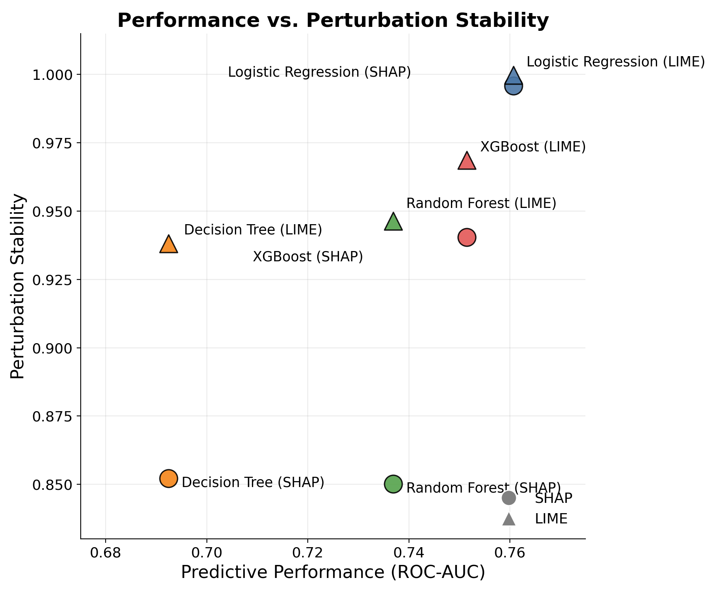

# Improving Trust in Credit Scoring Using Explainable Artificial Intelligence

A study evaluating whether SHAP and LIME actually produce stable, trustworthy explanations for credit scoring models, tested across four models spanning a range of structural complexity, from a fully transparent linear model to complex black-box ensembles.

M.Sc. in Data Science and Analytics · Toronto Metropolitan University
Author: Jeff Ogakwu · Supervisor: Dr. Isaac Woungang

---
Why it matters: In credit scoring, an explanation may have to be defended to a regulator or to someone who was turned down for a loan. This study shows that an explanation can't be trusted just because SHAP or LIME produced it, since its stability changed with the model, the method, and the kind of change being tested. On this dataset, the simplest and most transparent model was both the most accurate and the most trustworthy.

## Overview

Credit scoring increasingly relies on machine learning, and SHAP and LIME have become the standard tools for explaining these models to regulators and customers. However, a separate strand of the machine learning literature raises real doubts about whether these explanations can be trusted, showing that both methods can produce different explanations for the same prediction from sampling randomness alone. This instability has rarely been tested on structured credit data, or compared across models ranging from interpretable to black-box.

This project closes that gap directly: four credit scoring models were trained on the Home Credit Default Risk dataset, explained using both SHAP and LIME, and tested for explanation stability two ways — under small, realistic perturbations to an applicant's own data, and across genuinely similar real applicants — with statistical testing to confirm whether any differences found were real.

## Research Questions

1. How consistent are SHAP and LIME explanations for the same applicant profile under small input perturbations?
2. Do similar applicants receive similar explanations under the same trained credit-scoring model?
3. How does explanation stability differ between Logistic Regression and black-box models such as XGBoost?
4. Does higher predictive performance correspond to more stable explanations, or is there a trade-off between predictive accuracy and explanation stability?

## Key Findings

- **Logistic Regression was the most stable model tested, under both SHAP and LIME, on every metric and every statistical comparison run** — while also achieving the highest predictive performance (ROC-AUC 0.76) of all four models.
- **No evidence was found of a trade-off between predictive performance and explanation stability.** It's often assumed that more accurate models are harder to trust, but the top-performing model here, Logistic Regression, was also the most stable of the four tested.
- **XGBoost, despite being the most structurally complex model tested, was not the least stable**, and in several comparisons could not be statistically distinguished from a single Decision Tree.
- **LIME was more stable than SHAP for every model under small perturbations, without exception.**
- **Decision Tree combined with LIME produced a striking reversal**: comparatively stable under small perturbations, but the weakest agreement (0.38) of any combination tested when comparing genuinely similar real applicants, the lowest score recorded anywhere in the study.

The full reasoning, statistical tests, and discussion behind each of these findings are in the [full report](report/final_report.pdf).

## Repository Structure

```
credit-scoring-xai/
├── README.md
├── LICENSE
├── requirements.txt
├── data/
│   └── README.md              # how to obtain the dataset (not included, see below)
├── src/
│   ├── preprocessing/         # cleaning and feature engineering for each source table
│   ├── feature_selection/     # reducing the merged dataset to its final feature set
│   ├── models/                # training scripts for all four models
│   └── explainability/
│       ├── shap_lime_generation/   # base SHAP/LIME explanation generation
│       ├── perturbation_analysis/  # RQ1 — stability under small input changes
│       ├── similarity_analysis/    # RQ2 — stability across similar applicants
│       └── model_comparison/       # RQ3/RQ4 — cross-model and performance comparison
├── outputs/
│   ├── figures/                # EDA charts, stability comparison charts, SHAP summary plots
│   └── results/                # model performance and stability score CSVs
├── report/
│   └── final_report.pdf        # full 6-chapter report
└── docs/
    └── data_dictionary.md      # every feature in the final dataset, with derivation
```

## Dataset

This project uses the [Home Credit Default Risk dataset](https://www.kaggle.com/c/home-credit-default-risk) from Kaggle. The dataset is not included in this repository, in line with Kaggle's competition data terms. See `data/README.md` for download and setup instructions.

Four of the competition's source tables are used: the main application table, credit bureau history, previous Home Credit applications, and instalment repayment records. Chapter 3 of the [full report](report/final_report.pdf) documents exactly how these were cleaned, merged, and aggregated.

## Models

| Model | Role |
|---|---|
| Logistic Regression | Fully transparent, interpretable baseline |
| Decision Tree | Single-tree, still fully traceable but structurally different |
| Random Forest | Bagged ensemble of many independent trees |
| XGBoost | Boosted ensemble, trees trained sequentially to correct one another |

## Explainability & Stability Testing

Both [SHAP](https://github.com/slundberg/shap) and [LIME](https://github.com/marcotcr/lime) were used to generate an explanation for every sampled applicant, under every model. Two independent stability tests were then run:

- **Perturbation stability** — nudging an applicant's own data by a small, realistic amount and checking whether their explanation holds steady, measured with cosine similarity.
- **Similarity stability** — finding genuinely similar real applicants and checking whether they receive similar explanations, measured with feature-importance variance and Spearman rank correlation.

Differences between models were confirmed with Kruskal-Wallis and pairwise Mann-Whitney tests (Bonferroni-corrected), and the relationship between predictive performance and stability was examined with Pearson correlation.

## Reproducing the Results

```bash
# 1. Install dependencies
pip install -r requirements.txt

# 2. Download the dataset (see data/README.md) into data/raw/

# 3. Run preprocessing, in order
python src/preprocessing/application_preprocessing.py
python src/preprocessing/bureau_preprocessing.py
python src/preprocessing/previous_application_preprocessing.py
python src/preprocessing/instalments_preprocessing.py

# 4. Run feature selection
python src/feature_selection/select_features.py

# 5. Train all four models
python src/models/train_all_models.py

# 6. Generate SHAP and LIME explanations
python src/explainability/shap_lime_generation/generate_explanations.py

# 7. Run the stability analyses
python src/explainability/perturbation_analysis/run_perturbation_test.py
python src/explainability/similarity_analysis/run_similarity_test.py
python src/explainability/model_comparison/run_comparisons.py
```


## Results



Each point is one model under one explanation method. Models with higher predictive performance did not show lower stability, the opposite of the trade-off commonly assumed in the literature.

## Tech Stack

`Python` · `pandas` · `scikit-learn` · `XGBoost` · `SHAP` · `LIME` · `SciPy` . `statistical testing`· `matplotlib`

## Full Report

The complete report, covering the literature review, full preprocessing and exploratory data analysis, methodology, results, and conclusion, is available in [`report/final_report.pdf`](report/final_report.pdf).

## Author

**Jeff Ogakwu**
M.Sc. Data Science and Analytics, Toronto Metropolitan University
Supervisor: Dr. Isaac Woungang

## License

This project is licensed under the MIT License, see [LICENSE](LICENSE) for details.
